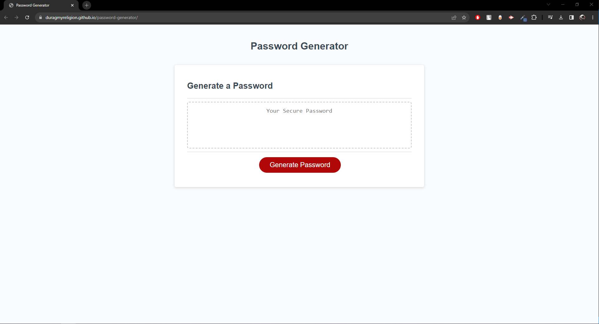

# password-generator

## Description

The reason behind making this project was to create a website that can automatically generated passwords.

I built this project to be able to randomly generate passwords with 8-128 characters, also including capital and lowercase letters, numbers and special characters.

It solves the problem of users struggling to think of passwords, when they can just come ton this website, answer the criteria correctly and generate a random password to their liking.

I learnt a lot creating this website, it helped improve my JavaScript skills immensely and taught me different features of JavaScript to use in the future ahead.

## Usage

This website can be used in different ways, below is a description of how to use it.

Link to deployed webpage:
https://duragmyreligion.github.io/password-generator/

Features:

1. Left click on 'Generate Password'. A prompt will display.

2. Enter in the prompt a number from 8-128. It will show the number of characters chosen.

3. Select 'OK' if you like to include lowercase characters. Cancel is also an option.

4. Select 'OK' if you like to include uppercase characters. Cancel is also an option.

5. Select 'OK' if you like to include special characters. Cancel is also an option.

6. Select 'OK' if you like to include numeric characters. Cancel is also an option. 

7. A password will be generated based off of the fields you selected.